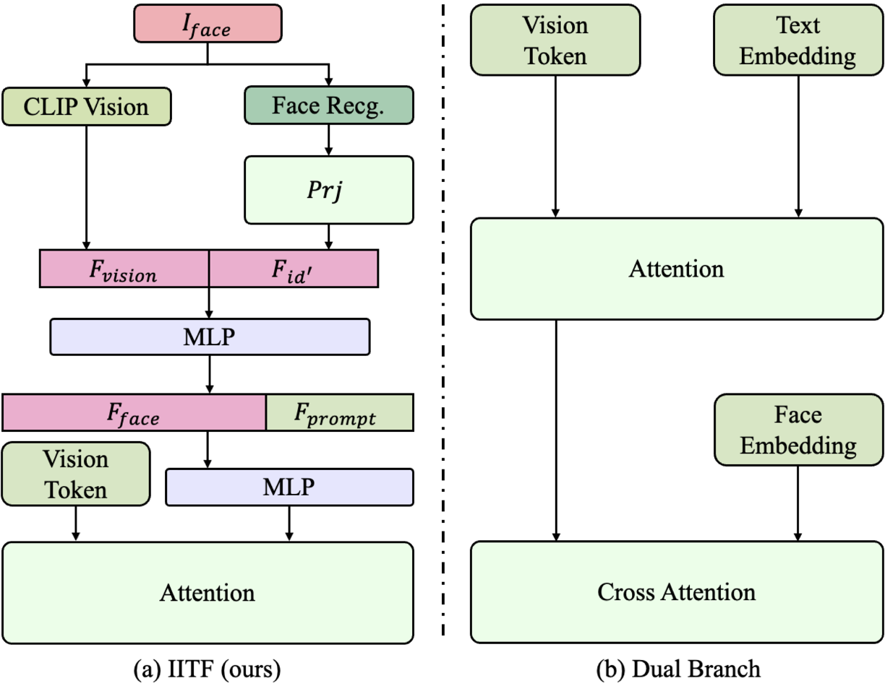

# EchoVideo: Identity-Preserving Human Video Generation by Multimodal Feature Fusion

This repo contains PyTorch model definitions, pre-trained weights and inference code for our video generation model, EchoVideo.
> [**EchoVideo: Identity-Preserving Human Video Generation by Multimodal Feature Fusion**](https://arxiv.org/abs/2501.13452) <be>

# News

**[2025.02.27]** We release the inference code and model weights of EchoVideo. [DownLoad](ckpts/README.md)

# Introduction

EchoVideo is capable of generating a personalized video from a single photo and a text description. It excels in addressing issues related to "semantic conflict" and "copy-paste" problems. And demonstrates state-of-the-art performance.


# Gallery
## 1. Text-to-Video Generation
| Face-ID Preserving | Full-Body Preserving|
| ---- | ---- |
| <video height="240" src="https://github.com/user-attachments/assets/201803ba-6988-492e-b389-c041fcea3624" > | <video height="240" src="https://github.com/user-attachments/assets/83c575d6-b50c-4fb0-91d5-e1e3f7f536da" > |

## 2. Comparisons
| EchoVideo | ConsisID | IDAnimator |
| ---- | ---- | ---- |
| <video height="180" src="https://github.com/user-attachments/assets/3e7aa0fb-07d4-486f-99ad-2fb5e8088b7e" > | <video height="180" src="https://github.com/user-attachments/assets/dfdefa7e-d69c-42f5-b78b-21924fe3f6fa" > | <video height="180" src="https://github.com/user-attachments/assets/8961168a-bb89-47d3-8b03-b0dd64d5e9ac" > |
| <video height="180" src="https://github.com/user-attachments/assets/236833e0-1d84-4319-8e31-1771f3284fd7" > | <video height="180" src="https://github.com/user-attachments/assets/0b765ffb-d553-42b4-b65f-6710750f31d5" > | <video height="180" src="https://github.com/user-attachments/assets/63a77e03-dd85-4591-97ce-51df4f0bb33d" > |


# Usage
**Python version is between 3.10 and 3.12, inclusive of both 3.10 and 3.12. Support both gpu and npu**

## Clone the repository:
```shell
git clone https://github.com/bytedance/EchoVideo
cd EchoVideo
```

## Installation
```shell
pip install -r requirements.txt
```
## Download Pretrained Weights
The details of download pretrained models are shown [here](ckpts/README.md).
## Run Demo
```shell
# multi-resolution video generation [(480, 640), (480, 848), (480, 480), (848, 480), (640, 480)]
python infer.py
```

# Methods
## **Overall Architecture**
<p align="center">
  
</p>

Overall architecture of EchoVideo. By employing a meticulously designed IITF module and mitigating the over-reliance on input images, our model effectively unifies the semantic information between the input facial image and the textual prompt. This integration enables the generation of consistent characters with multi-view facial coherence, ensuring that the synthesized outputs maintain both visual and semantic fidelity across diverse perspectives.

## **Key Features**
<p align="center">
  
</p>


Illustration of facial information injection methods. (a) IITF. Facial and textual information are fused to ensure consistent guidance throughout the generation process. we propose IITF to fuse text and facial information, establishing a semantic bridge between facial and textual information, coordinating the influence of different information on character features, thereby ensuring the consistency of generated characters. IITF consists of two core components: facial feature alignment and conditional feature alignment. (b) Dual branch. Facial and textual information are independently injected through Cross Attention mechanisms, providing separate guidance for the generation process.  

## Benchmark

| Model | Identity Average↑ | Identity Variation↓ | Inception Distance↓ | Dynamic Degree↑ |
| -- | -- | -- | -- |-----------------|
| IDAnimator | 0.349 | **0.032** | **159.11** | 0.280           |
| ConsisID | <u>0.414</u> | 0.094 | 200.40 | 0.871           |
| pika | 0.329 | 0.091 | 268.35 | <u>0.954</u>    |
| Ours | **0.516** | <u>0.075</u> | <u>176.53</u> | **0.955**       |

# Acknowledgements
* [CogVideo](https://huggingface.co/THUDM/CogVideoX-5b): The DiT module we adpated from, and the VAE module we used.
* [SigLip](https://huggingface.co/google/siglip-base-patch16-224): Vision Encoder we used.


# BibTeX
If you find our work useful in your research, please consider citing the paper
```bibtex
@article{wei2025echovideo,
  title={EchoVideo: Identity-Preserving Human Video Generation by Multimodal Feature Fusion},
  author={Wei, Jiangchuan and Yan, Shiyue and Lin, Wenfeng and Liu, Boyuan and Chen, Renjie and Guo, Mingyu},
  journal={arXiv preprint arXiv:2501.13452},
  year={2025}
}
```
